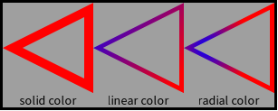
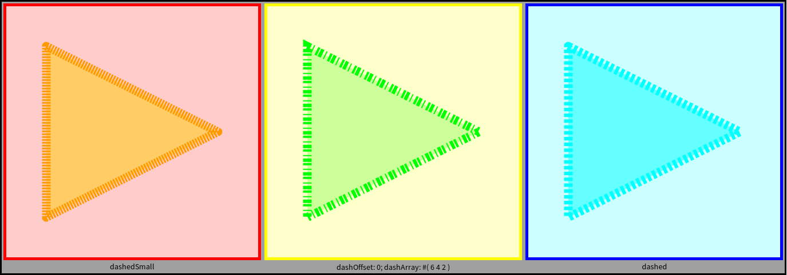
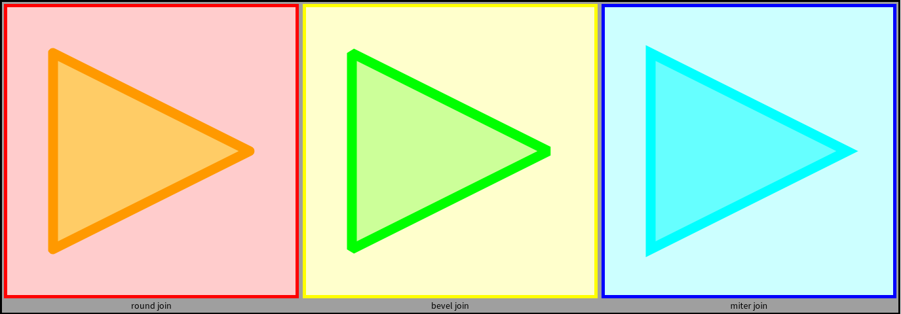
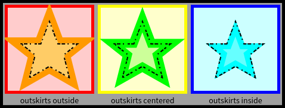
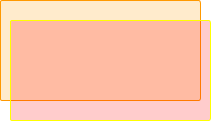
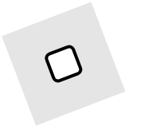

# Bloc & BlElement

## introduction

**Bloc** is the new graphical framework developped for Pharo. Initially
developped by Pharo team, it has been extended by Feenk team for GToolkit. Their
work is now being integrated back into **Pharo**. It should ultimately replace
the aging **Morphic** graphical framework,

To install it in Pharo 11, simply type in the playground

```smalltalk
[ Metacello new
baseline: 'Bloc';
repository: 'github://pharo-graphics/Bloc:dev-1.0/src';
onConflictUseIncoming;
ignoreImage;
load ]
on: MCMergeOrLoadWarning
do: [ :warning | warning load ].
```

Bloc is designed to favor composition over inheritance. Basic bloc element can
be customized, and added to each other, to create higher level component. The
root of all graphical Bloc element is **BlElement**.

Bloc introduce new concept in the user interface. With Bloc, we  deal with
**BlUniverse** and **BlSpace**. **BlSpace** is an operating system window in
which the Pharo systems is executed. If you have more than one BlSpace opened,
they will be listed as part of BlUniverse - a list of all available BlSpace in
your current Pharo session.

Let's create our first Bloc component.  

```smalltalk
BlElement new
geometry: BlRectangleGeometry  new;
size: 200 @ 100;
background: Color blue;
openInNewSpace
```

Once executed, a new window should appear on your desktop, with a white
background, and a blue rectangle inside. Let's look at it in more detail.

We first create a new BlElement. It's a blank element, and if you try to display
it, you won't see anything. The shape of your element, in Bloc, is defined by its geometry so we must specify it.  It's a simple rectangle in our
example, but it can be much more complicated. We'll look at geometry in more
detail later. We then define its size, its color, and then ask to open it in
a new space.

## element shape & color

* geometry (bounds)
* border & outSkirts (outside, centered, inside)
* background

### geometry of BlElement

Geometry will define the shape and the bounds of your element. Each element can
have only one geometry. You can also see each element as a *geometry*
encasulated inside a hidden rectangle (its bounds). There are several geometry
figures available: `BlElementGeometry allSubclasses`

Bloc offer a very nice way of creating custom component with advanced
layout possibilities to mix and position different graphical elements together.

When drawing with Alexandrie canvas, you may have noticed the
few primitives that we where using: lines, curves and bezier curves. Here is an
example of different geometry primitives available in pharo.


* **Annulus** : `BlAnnulusSectorGeometry new startAngle: 225; endAngle: 360;   innerRadius: 0.3; outerRadius: 0.9);`
* **bezier** : `BlBezierCurveGeometry controlPoints: { 5@0. 25@80. 75@30. 95@100 }`
* **circle** : `BlCircleGeometry new matchExtent: 100 @ 50`
* **ellipse** : `BlEllipseGeometry new matchExtent: 100 @ 50)`
* **line** : `BlLineGeometry from: 10@10 to: 90@90`
* **Polygon** : `BlPolygonGeometry vertices: {(10 @ 10). (10 @ 90). (50 @ 50). (90 @ 90). (90 @ 10)}`
* **Polyline**: `BlPolylineGeometry vertices: {(10 @ 10). (10 @ 90). (50 @ 50).(90 @ 90). (90 @ 10) }`
* **Rectangle** : `BlRectangleGeometry  new`
* **Rounded rectangle** : `BlRoundedRectangleGeometry cornerRadius: 20`
* **square** : `BlSquareGeometry new matchExtent: 70 @ 70`
* **triangle** : `BlTriangleGeometry new matchExtent: 50 @ 100; beLeft`

### element border

The geometry is like a an invisible line on which your border is painted. The
painting is a subclass of **BlPaint**, and one of the three:

* solid color
* linear gradient color
* radial gradient color



Your border opacity can be specified as well: `opacity: 0.5;`

By default, your border will be a full line, but it can also be dashed, with
**dash array** and **dash offset**. Dash array define the number of element, and
dash offset, the space between elements.

You also have pre-defined option, available in a single call:

* **dashed**
* **dashed small**



If the path is not closed, The style extent of your border can be defined with

* **cap square**
* **cap round**
* **cap butt**

Last, when the line of your border cross each other, you can define the style of
the join:

* **round join**
* **bevel join**
* **mitter join**



You have two option to define your border:

* short call : `border: (BlBorder paint: Color orange width: 5)`
* with a builder :`BlBorder builder dashed; paint: Color red; width: 3; build`

The first one is very helpfull for solid line definition. The builder let use
customize all the detail of your border.

### elements bounds and outskirts

Lets look at the diffent possible bounds of your element.

**Layout bounds** can be defined explicitly using **size:** method or dynamicaly
Layout bounds are considered by layout algorithms to define mutual locations
for all considered elements. You'll know more about layout later.

**Geometry bounds** area is defined by minimum and maximum values of polygon
vertices. This does not take in account the border width

**Visual bounds** is an exact area occupied by an element. it takes strokes
and rendering into account.

The geometry is like a an invisible line on which your border is represented.
The border drawing can happen outside (adding its border size to the size of
your element), centered, or inside the geometry of the element. The final size
(geometry + border width) will define the **bounds** of your element.

In this figure, the same exact star is drawned 3 time. The only difference is
the outskirts definition between those 3.



If we specify BlOutskirts inside, visual bound and geometry bounds will be the
same. But if BlOutskirts is outside, then visual bounds are larger than
geometry bounds to take border width into its calculation.

### element background

quick set-up: `background: (Color red alpha: 0.8);`

background: (Color r: 63 g: 81           b: 181     range: 255);
background: ((BlLinearGradientPaint direction: 1 @ 1) from: Color red to: Color blue).

background: (BlRadialGradientPaint new
stops: { 0 -> Color blue. 1 -> Color red };
center: largeExtent // 2;
radius: largeExtent min;
yourself);

background: ((BlPaintBackground paint: fillColor asBlPaint) opacity: 0.75; yourself);


### element effect

`BlElementEffect allSubclasses`

```smalltalk
BlElement new
        size: 200 @ 100;
        geometry: (BlRoundedRectangleGeometry cornerRadius: 2);
        background: (Color red alpha: 0.2);
        border: (BlBorder paint: Color yellow width: 1);
        outskirts: BlOutskirts centered;
        effect:
            (BlSimpleShadowEffect color: Color orange offset: -10 @ -20)
```



effect: (BlSimpleShadowEffect
color: (Color orange alpha: shadowAlpha)
offset: shadowOffset);

```smalltalk
BlElement new
        size: 300 @ 150;
        geometry: (BlRoundedRectangleGeometry cornerRadius: 2);
        background: (Color blue alpha: 0.5);
        border: (BlBorder paint: Color red width: 10);
        effect: (BlGaussianShadowEffect color: Color yellow offset: 10@20 width: 5)
```


### element opacity

`element opacity:`, value between 0 and 1, 0 meaning completely transparent
You can apply opacity to background, border, or to your hole element.


## element transformation

You can apply transformation to a BlElement:

- rotation
- translation
- Scaling
- reflection
- etc...

transformDo: [ :b | b scaleBy: 0.2; translateBy: -25 @ -15 ];

```smalltalk
aContainer := BlElement new
                    layout: BlFrameLayout new;
                    constraintsDo: [ :c |
                        c horizontal fitContent.
                        c vertical fitContent ];
                    padding: (BlInsets all: 20);
                    background: (Color gray alpha: 0.2).

node := BlElement new
            geometry: (BlRoundedRectangleGeometry cornerRadius: 4);
            border: (BlBorder paint: Color black width: 2);
            background: Color white;
            constraintsDo: [ :c |
                c frame horizontal alignCenter.
                c frame vertical alignBottom ];
            size: 20 @ 20.

aContainer transformDo: [ :t |
    t
        scaleBy: 2.0;
        rotateBy: 69;
        translateBy: 50 @ 50 ].
aContainer addChild: node.

aContainer forceLayout.
```



## Bloc styles

## element custom Painting

Bloc really favor BlElement composition to create your interface. Most of the
time, you will not have to create a custom painting of your element widget. You
can already do a lot with existing geometry.

Ultimately, you can define
drawing methods on a canvas, but once drawn, a canvas cannot be easily inspected
for its elements. However, Bloc element composition create a tree of elements,
that can be inspected, and shaped dynamically.

 creating and drawing your own block
=> subclass BlElement
=> Custom drawing is done with drawOnSpartaCanvas: method.
=>

BlElement >> aeFullDrawOn: aCanvas
"Main entry point to draw myself and my children on an Alexandrie canvas."

self aeDrawInSameLayerOn: aCanvas.

self aeCompositionLayersSortedByElevationDo: [ :each | each paintOn: aCanvas ].

Element geometry is taken care by:
BlElement >> aeDrawGeometryOn: aeCanvas
Painting is done on an Alexandrie Canvas, then rendered on the host:
BARenderer (BlHostRenderer) >> render: aHostSpace, display on a AeCairoImageSurface

Drawing is done through method 'drawOnSpartaCanvas', which receive a sparta
(vector) canvas as an argument.

1. aeDrawChildrenOn:
2. aeDrawOn:
3. aeDrawGeometryOn:

## UI Building

<https://github.com/OpenSmock/Pyramid/tree/main>
