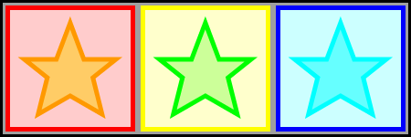
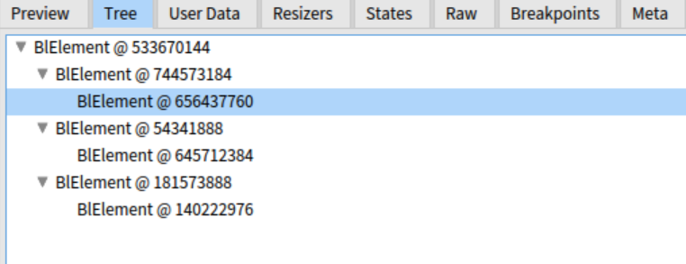
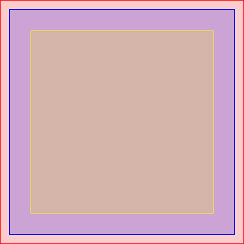
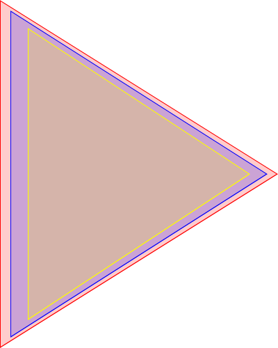
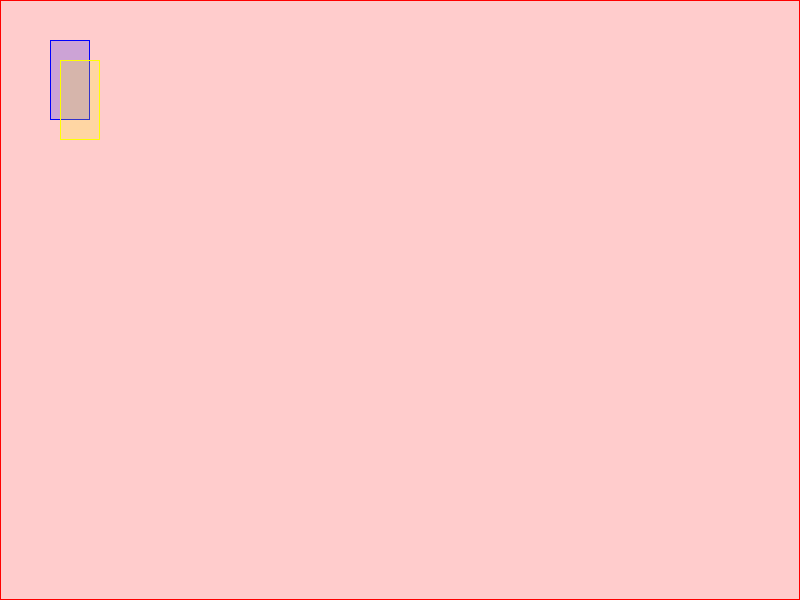
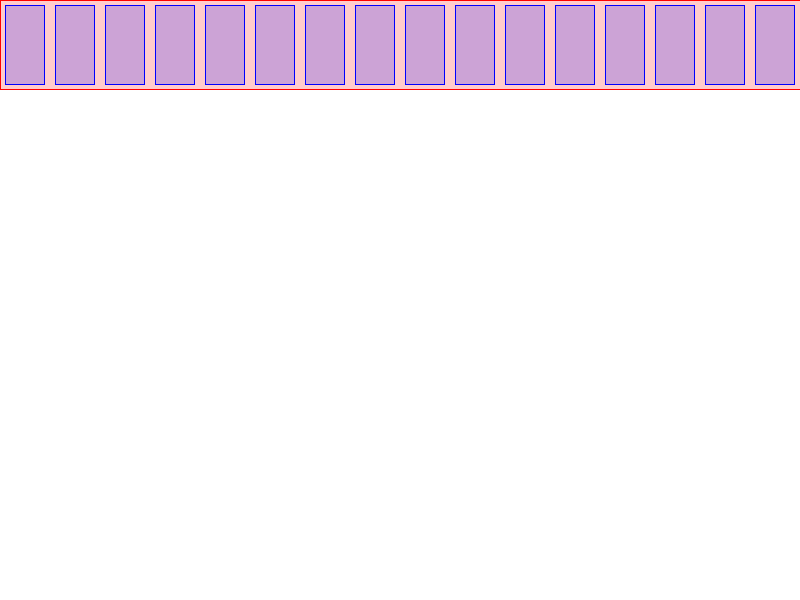
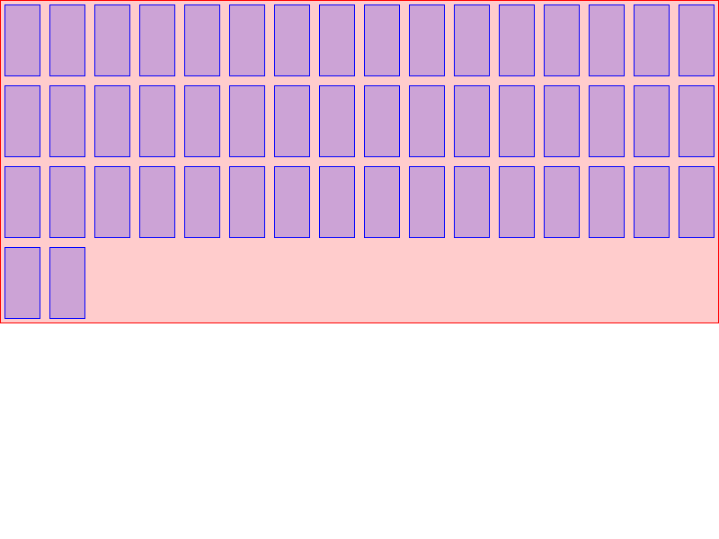
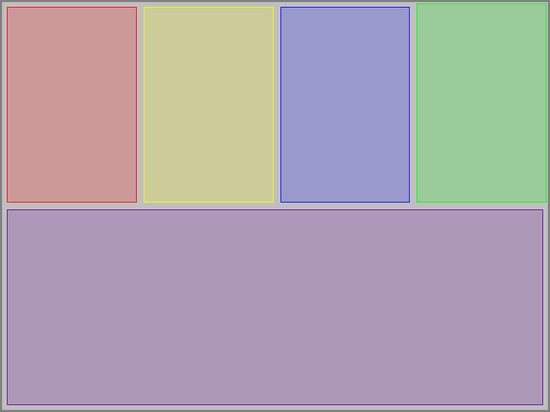
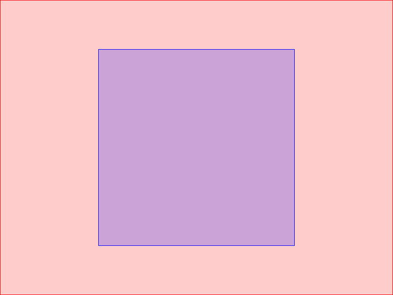
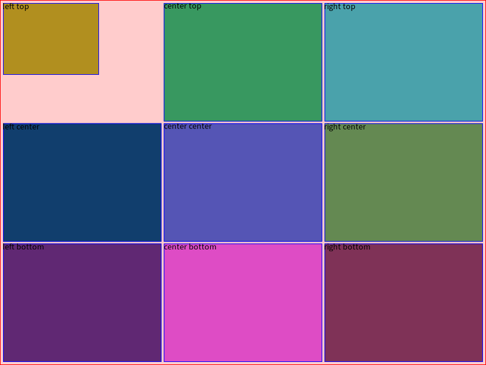

# Bloc Layout

## introduction

Widgets aren't just simple components; they're complex assemblies of various
elements. To create more intricate block elements, you'll need to blend them
together seamlessly. Each element can be developed and examined independently,
which is advantageous during the development phase.  However, to construct a
complete graphical interface, you'll need to seamlessly integrate these elements
with each other or, at the very least, place them within a bloc *space*.

Element in a bloc scene are added to each other, ending in a tree-like structure
where parents and children can identify each other, and each element being an
instance of BlElement, the root element of Bloc.. Each element have its own
visual properties, like background, border, geometry, etc. The final appearance
depends on the graphical properties of each element and how they're arranged
together in the layout.





Layout constitutes a fundamental aspect of *Bloc*. Rather than constructing your
entire widget within a single *drawing* method, it advocates for the creation of
small elements with distinct geometries and visual attributes, which are then
integrated using diverse layout strategies. The layout property determines the
visual arrangement of the element and its descendants, specifying their
positions and sizes within the parent container. Moreover, it may influence the
dimensions of the parent element itself.

When defining layout, 2 parts must be combined to play together: *parent* and
*children* elements.

* Parent define which layout strategy to apply to their children
* children specify which constraints they will follow, which could impact their
position and their size.

Layout are defined by their *type* and they *constraints*. Type are usually
defined by at the parent level with **layout** method, while you can specify
contraints to your child element using the **constraintsDo:** message, which
support a set of attributes which define the visual properties of the layout. A
small set of constraints, like padding, margin or minimal and maximum
dimensions, are common among all the layouts. Constraints allows you to clearly
defined the size and the position of your element withing its parent.

When you change the position or the size of an element, a requestLayout is sent
but the effect on the element’s bounds is actually visible only after the layout
is computed. In bloc, the layout is computed from a dedicated space Phase,
applied on each pulse. Have a look at BlSpaceFrame and BlSpaceFramePhase and its
subclasses.

To easy this kind of script one can use *#whenLayoutedDoOnce:* which arms a one
shot event handler that reacts to the *BlElementLayoutComputedEvent* event.

### element combination

Elements can be combined with the **addChild:** method. You can add multiple
elements at once with **addChildren:**. You can of course remove sub-element
with **removeChild:** and **removeChildren:** method.

Look at **children add/remove** protocol of *BlElement* for all available method
to manage addition and removal of the elements composing your widget.

### space around elements

Before jumping on the defintion of the position of each element, you can already
define how close your element will be from each other, with those 2 properties

* **padding:** space between the element and its children.
* **margin:** space between the element and its parent

Constraint can apply to margin and padding as well,
as `constraintsDo: [ :c | c margin: (BlInsets all: 10) ])`

```smalltalk
    container := BlElement new
                 "no dynamic constraints, we specify element size"
                size: 400 @ 400;
                border: (BlBorder paint: Color red width: 1);
                background: (Color red alpha: 0.2);
                layout: BlFlowLayout horizontal alignCenter.

    element := BlElement new
                   border: (BlBorder paint: Color blue width: 1);
                   background: (Color blue alpha: 0.2);
                   margin: (BlInsets all: 15);
                   padding: (BlInsets all: 35);
                      "element has a child, specify its layoutSpec: "
                   layout: BlFlowLayout horizontal alignCenter;
                     "dynamic size computed relatively to its parent"
                   constraintsDo: [ :c |
                       c horizontal matchParent.
                       c vertical matchParent ].
    container addChild: element.

    child := BlElement new
                 border: (BlBorder paint: Color yellow width: 1);
                 background: (Color yellow alpha: 0.2);
                    "dynamic size computed relatively to its parent"
                 constraintsDo: [ :c |
                     c horizontal matchParent.
                     c vertical matchParent ].
    element addChild: child.
```

In this figure, we have 3 elements on top of each others. The purple one
has a margin of 15 pixel with the red one and a padding of 35 pixel with the
yellow one.



Margin and padding can be applied to all insets for your figures, but need to
be adapted to your element geometry. The same example but using triangle
geometry will show you the difference.



### element size

Size can be determined **statically** or **dynamically**. Attention, If you
don't use dynamic size, you **must** define it with **size:**. The overall
bounds of the element is not deduced from its geometry, and its default size
will be *50@50*, which will certainly be different from *your* own element.

If you use **size:**, the size of the element will be static.
`element size: aPoint` is a synonym for

```smalltalk
constraintsDo: [ :c |
    c horizontal exact: aPoint x.
    c vertical exact: aPoint y ];
```

If you use the constraints **matchParent** or **fitContent** in child
definition, the size of the element will be computed dynamically, dependent of
its parent constraints and child space.

* **matchParent**: Child size will fill space left available in parent element.
* **fitContent** : parent size will depend of the space used by child.

```smalltalk
constraintsDo: [ :c |
    c horizontal matchParent.
    c vertical fitContent ];
```

**Beware to not mix those properties** between parent and child.
If your child try to mach its parent, while its parent try to fit its child
content, the size will be 0 plus the border width.

when the parent uses "fit content" and the child uses "match parent", there is
no way to determine the size. In such cases, the size of both the parent and
the child will be 0@0.

## Layout strategy and constraints

Layout define the way children are positioned inside their parent element. This
position is deduced from the layout strategy used. If you don't specify which
layout your parent element will use, it'll default to **BlBasicLayout** strategy.

You can add element with **addChild:**, and the will be disposed according the
the layout specified.

A small list of layout included in Pharo Image.

* BlBasicLayout
* BlLinearLayout
* BlFlowLayout
* BlGridLayout
* BlFrameLayout
* BlZoomLayout
* BlProportionalLayout

The list of all layout available: `BlLayout allSubclasses`

Each layout has a dedicated constraint object, an instance of
*BlLayoutCommonConstraints*, that contains layout universal constraints.
Constraints are associated with the layout defined by parent element.
Each type of layout can further define its own specific constraints by creating
a subclass of **BlLayoutConstraints**.

**Example:**

* parent element use layout type *BlLinearLayout*
* children constraints are detailed by *BlLinearLayoutConstraints*

You can define constraints at the parent element level when specifying layout
type: `layout: BlLinearLayout horizontal alignCenter;`

or you can refine it constraints in its children
`constraintsDo: [ :c | c linear horizontal alignCenter. ]`

The first option let you define position constraint that apply to all children,
and is a good fit for *flow layout* or *linear layout*. For layout that have a
limited number of child, like *frame layout*, it's better to let children decide
of their position constraints. You'll find some example below.

### overriding or redefining parent layout

You can ignore the layout define by the parent using *ignoreLayout* or override
it using *flow*, *frame*, *grid*, *linear* or *relative* message.

```smalltalk
constraintsDo: [ :c |
            c ignoreByLayout.
            c ignored horizontal alignRightAt: 1.1.
            c ignored vertical alignTopAt: 1.1 ].
```

### Example

This define a new element, where children will be positioned using linear
layout strategy, and whose side will match space available in parent element.

```smalltalk
BlElement new
layout: BlLinearLayout horizontal alignCenter;
constraintsDo: [ :c |
    c horizontal matchParent.
    c vertical matchParent ].
```

### default layout: basicLayout

If your parent don't define any specific layout, it will default to *BlBasicLayout*.
Using this layout, children can position themselves at arbitrary position within
the parent coordinate space using *position:*

`BlElement new position: 50@50.`

"BlBasicLayout let you position your children at the position you want them to
be Layout constraint are irrelevant for this layout, you should specify the size
of each child element to be added. Those child can them implement their own
layout strategy"

#### example

```smalltalk
    root := BlElement new
                border: (BlBorder paint: Color red width: 1);
                background: (Color red alpha: 0.2);
                "not necessary, except for reminder, this is the default layout"
                  "layout: BlBasicLayout new;"
                constraintsDo: [ :c |
                    c horizontal matchParent.
                    c vertical matchParent ].

    elt1 := BlElement new
                border: (BlBorder paint: Color blue width: 1);
                size: 40 @ 80;
                background: (Color blue alpha: 0.2);
                position: 50 @ 40.
    elt2 := BlElement new
                border: (BlBorder paint: Color yellow width: 1);
                size: 40 @ 80;
                background: (Color yellow alpha: 0.2);
                position: 60 @ 60.

    root addChildren: {
            elt1.
            elt2 }.
```



### Linear layout - BlLinearLayout

Child can use dynamic size with constraints. The number of element will then fit
its parents available space.     If you specify their size, and the total is
over its parents, they will be hidden. need to specify their size. If they use
constraint, the last one will hide previous one. They will fit available space +
move to next line if necessary

#### parent definition

* horizontal
* vertical

#### child constraints

* horizontal
  * alignCenter
  * alignLeft
  * alignRight
* vertical
  * alignBottom
  * alignCenter
  * alignTop

#### example

```smalltalk
root := BlElement new
                border: (BlBorder paint: Color red width: 1);
                background: (Color red alpha: 0.2);
                layout: BlLinearLayout horizontal ;
                  constraintsDo: [ :c |
                       c horizontal fitContent.
                       c vertical fitContent  ].
    
    50 timesRepeat:  [  |elt| elt := BlElement new border: (BlBorder paint: Color blue width: 1);
                    size: 40@80;
                   background: (Color blue alpha: 0.2);
                   margin: (BlInsets all: 5);
                   padding: (BlInsets all: 5).

            root addChild: elt. ].
```



### flow layout - BlFlowLayout

Child need to specify their size. If they use constraint, the last one will hide
previous one. They will fit available space + move to next line if necessary.
Flow will fill all available space in its parent, and parent can be resized to
match the space needed to display all its children.

#### parent definition

* horizontal
* vertical

#### child constraints

* horizontal
  * alignCenter
  * alignLeft
  * alignRight
* vertical
  * alignBottom
  * alignCenter
  * alignTop

#### example

```smalltalk
root := BlElement new
                border: (BlBorder paint: Color red width: 1);
                background: (Color red alpha: 0.2);
                layout: BlFlowLayout horizontal;
                constraintsDo: [ :c |
                       c horizontal matchParent .
                       c vertical fitContent  ].


    50 timesRepeat: [
        | elt |
        elt := BlElement new
                   size: 40 @ 80;
                   border: (BlBorder paint: Color blue width: 1);
                   background: (Color blue alpha: 0.2);
                   margin: (BlInsets all: 5).
        root addChild: elt ].
```



### grid layout - BlGridLayout

Element are disposed in a grid.Element can span over multiple row or columns.

All children of an element with GridLayout must use GridConstraints that allows
users to configure how children are located within grid independently.

A grid consists of cells that are separated by invisible lines. Each line is
assigned to an index, meaning that a grid with N columns would have N+1 line.
Indices lie in closed interval [ 1, N + 1 ].

Grid Layout supports fitContent, matchParent and exact resizing mode of the
owner. Children are allowed to have fitContent and exact resizing modes. Because
child's matchParent does not make sense in case of grid users should use #fill
to declare that child should take all available cell's space.

By default grid layout does not specify how many columns and rows exist, instead
it tries to compute necessary amount of columns or rows depending on amount of
children. User can specify amount of columns or rows by sending columnCount: or
rowCount: to an instance of grid layout.

Grid Layout supports spacing between cells which can be set sending cellSpacing:
message.

Public API and Key Messages

* **columnCount:** aNumber to specify amount of columns
* **rowCount:** aNumber to specify amount of rows
* **cellSpacing:** aNumber to specify spacing between cells
* **alignMargins**  bounds of each element are extended outwards, according to their margins, before the edges of the resulting rectangle are aligned.
* **alignBounds**  alignment is made between the edges of each component's raw bounds

#### example

```smalltalk
    e1 := BlElement new
              constraintsDo: [ :c |
                  c horizontal matchParent.
                  c vertical matchParent ];
              background: (Color red alpha: 0.2);
              border: (BlBorder paint: Color red width: 1).

    e2 := BlElement new
              constraintsDo: [ :c |
                  c horizontal matchParent.
                  c vertical matchParent ];
              background: (Color yellow alpha: 0.2);
              border: (BlBorder paint: Color yellow width: 1).
    e3 := BlElement new
              constraintsDo: [ :c |
                  c horizontal matchParent.
                  c vertical matchParent ];
              background: (Color blue alpha: 0.2);
              border: (BlBorder paint: Color blue width: 1).

    e4 := BlElement new
              constraintsDo: [ :c |
                  c horizontal matchParent.
                  c vertical matchParent ];
              background: (Color green alpha: 0.2);
              margin: (BlInsets all: 5);
              border: (BlBorder paint: Color green width: 1).

    e5 := BlElement new
              constraintsDo: [ :c |
                  c horizontal matchParent.
                  c vertical matchParent.
                  c grid horizontal span: 4 ];
              background: (Color purple alpha: 0.2);
              border: (BlBorder paint: Color purple width: 1).

    container := BlElement new
                     layout: (BlGridLayout new
                              columnCount: 4;
                              cellSpacing: 10);
                     background: Color veryLightGray;
                     border: (BlBorder paint: Color gray width: 3);
                     constraintsDo: [ :c |
                         c horizontal matchParent.
                         c vertical matchParent ];
                     addChildren: {
                             e1.
                             e2.
                             e3.
                             e4.
                             e5 };
                     yourself.
```



### Frame Layout

Frame layout prefered usage contains only one child. Its Give more dynamic
control than BlBasicLayout which only allow fixed position. It can however
contain multiple children.

The alignment attribute controls the position of children within a FrameLayout.
Children can be aligned both vertically and horizontally as follows:

* horizontally children can be aligned to left, center or right;
* vertically children can be aligned to top, center or bottom.

Alignment is a constraint specific to frame layouts, as it's not relevant to
all layouts. To access frame-specific contraints, we send *frame* to the current
constraint object, which returns an instance of *BlFrameLayoutConstraints* that
we can use to set the desired alignment. Other constraints like the size of an
element are common to all layouts and can be set directly without requesting a
specific constraint object.

When using multiple children, if we do not specify any alignment they will be
placed in the top-left corner in the order in which they were added to the
parent and they will overlap each other.

#### parent definition

`BlFrameLayout new`

* align:horizontal
* align:vertical

*TODO* Check class BlElementAlignment and *weight:* message

#### children constraints

* horizontal
  * alignCenter
  * alignLeft
  * alignRight
  * alignCenterAt:
  * alignLeftAt:
  * alignRightAt:
  * alignNone

* vertical
  * alignBottom
  * alignCenter
  * alignTop
  * alignBottomAt:
  * alignCenterAt:
  * alignTopAt:
  * alignNone

#### example

One children

```smalltalk
container := BlElement new
                     background: (Color red alpha: 0.2);
                     border: (BlBorder paint: Color red width: 1);
                     layout: BlFrameLayout new;
                     constraintsDo: [ :c |
                         c horizontal matchParent.
                         c vertical matchParent ].

    child := BlElement new
                 size: 400 @ 400;
                 clipChildren: false;
                 background: (Color blue alpha: 0.2);
                 border: (BlBorder paint: Color blue width: 1);
                 constraintsDo: [ :c |
                     c frame horizontal alignCenter.
                     c frame vertical alignCenter  ].

    container addChild: child.
```



Frame can also accept multiple children

Multiple children positioned with size defined by weight. In this case, children
that match their parent can also be configured to occupy only a fraction of
the parent's size using the weight attribute. A child can match its parent both
horizontally and vertically. If no padding or margin is used, the child will
overlap the parent completely.

```smalltalk
| root elt1 elt2 elt3 elt4 elt5 elt6 elt7 elt8 elt9 |
root := BlElement new
            border: (BlBorder paint: Color red width: 1);
            background: (Color red alpha: 0.2);
            layout: BlFrameLayout new;
            constraintsDo: [ :c |
                c horizontal matchParent.
                c vertical matchParent ].

"weight can only be used if the size, or if fitContent are not specified"
elt1 := BlElement new
            border: (BlBorder paint: Color blue width: 1);
            background: Color random;
            margin: (BlInsets all: 5);
            constraintsDo: [ :c |
                c frame horizontal alignLeft weight: 0.2.
                c frame vertical alignTop weight: 0.2.
                c horizontal matchParent.
                c vertical matchParent ];
            addChild: (BlTextElement new text: 'left top' asRopedText).
root addChild: elt1.

"...code continue for the 8 other children"
```



Multiple children positioned with fixed size

```smalltalk
| root elt1 elt2 elt3 elt4 elt5 elt6 elt7 elt8 elt9 |
root := BlElement new
            border: (BlBorder paint: Color red width: 1);
            background: (Color red alpha: 0.2);
            layout: BlFrameLayout new;
            constraintsDo: [ :c |
                c horizontal matchParent.
                c vertical matchParent ].

elt1 := BlElement new
            size: 80 @ 80;
            border: (BlBorder paint: Color blue width: 1);
            background: Color random;
            margin: (BlInsets all: 5);
            constraintsDo: [ :c |
                c frame horizontal alignLeft.
                c frame vertical alignTop ];
            addChild: (BlTextElement new text: 'left top' asRopedText).
root addChild: elt1.

"...code continue for the 8 other children"
```


### zoom Layout

A layout where child element can be zoomed into their parent.

#### example

```Smalltalk
|elt zoom|

elt := BlSvgIcons settingsIcon.
elt
    border: (BlBorder paint: Color red width: 2);
    background: Color yellow;
    size: 24@24;
    transformDo: [ :t | t scaleBy: 2 ];
    constraintsDo: [ :c |
        c accountTransformation.].


zoom := BlElement new
            background: Color white;
            border: (BlBorder paint: Color gray width: 10);
            geometry: (BlRoundedRectangleGeometry cornerRadius: 4);
            padding: (BlInsets all: 10);
            layout: (BlZoomableLayout new
                        addLayout: BlFrameLayout new;
                        defaultScale: 5;
                        animationDuration: 2 second);
            constraintsDo: [ :c |
                        c vertical fitContent.
                        c horizontal fitContent ];
            addChild: elt;
            yourself.
zoom openInNewSpace 
```

#### example

```smalltalk
    elt := BlElement new
                size: 200@200;
               background: (Color blue alpha: 0.2);
               border: (BlBorder paint: Color blue width: 1);
        constraintsDo: [ :c | c accountTransformation ].

    container := BlElement new
                     background: Color white;
                     border: (BlBorder paint: Color gray width: 1);
                     geometry: (BlRoundedRectangleGeometry cornerRadius: 4);
                     padding: (BlInsets
                              top: 10
                              left: 10
                              bottom: 10
                              right: 10);
                     layout: (BlZoomableLayout new
                              addLayout: BlFrameLayout new;
                              defaultScale: 2;
                              animationDuration: 1 second);
                     constraintsDo: [ :c |
                         c vertical fitContent.
                         c horizontal fitContent ];
                     addChild: elt;
                     yourself.
```

As this example is dynamic, it's better if you look at the example or try this
code directly into Pharo. As screenshot couldn't render it properly.

### Proportional layout

layout that determines the position and extent of each child of an element by
taking into account fractions defined in the constraints.

#### parent definition

`BlProportionalLayout new`

#### children constraints

* horizontal
  * left
  * right

* vertical
  * bottom
  * top

#### example

```smalltalk
| aContainer childA childB |
childA := BlElement new
    id: #childA;
    background: Color red;
    constraintsDo: [ :c |
        c proportional horizontal rightFraction: 0.5 ];
    yourself.

childB := BlElement new
    id: #childB;
    background: Color green;
    constraintsDo: [ :c |
        c proportional horizontal leftFraction: 0.5 ];
    yourself.

aContainer := BlElement new
    id: #container;
    background: Color blue;
    layout: BlProportionalLayout new;
    size: 100 @ 100;
    addChild: childA;
    addChild: childB;
    constraintsDo: [ :c |
        c horizontal matchParent.
        c vertical matchParent ];
    padding: (BlInsets all: 5);
    yourself.

aContainer openInNewSpace.
```
