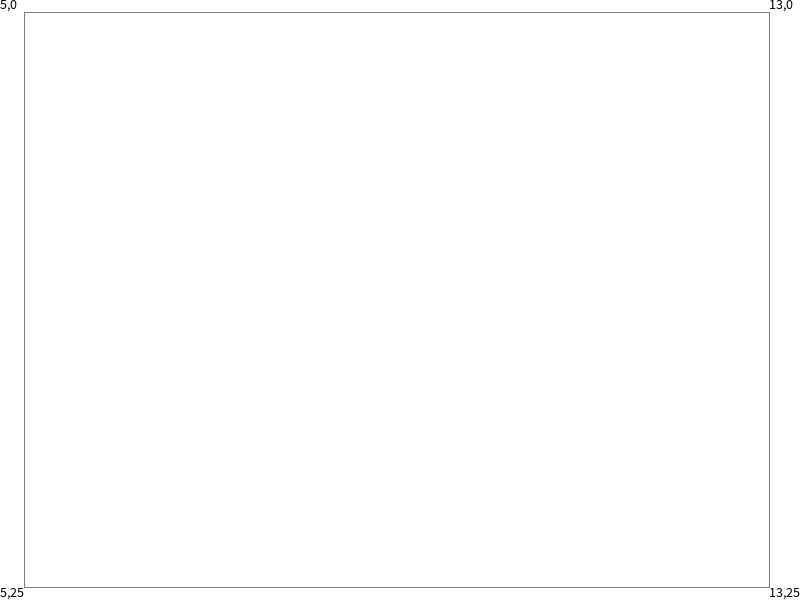

# introduction

Bloc comes with a full API to deal with text. Not only you can deal with
raw text, but you can apply styles as well.

Before being displayed, you define your text as an instance of **BlRopedText**,
which you can then style with **attributes** like:

- font name
- font size
- font foreground and background color
- font style (normal, italic, bold).

```smalltalk
labelText := 'hello from bloc' asRopedText
foreground: Color orange;
fontSize: 16;
fontName: 'Helvetica';
thin.

label := BlTextElement new.
label text: labelText.

label openInNewSpace
```

Another way to define attributes, is to pass them as
a collection:

```smalltalk
BlTextElement new
        position: 5 @ 5;
        text: ('Rainbow!' asRopedText attributes:
        { (BlTextForegroundAttribute paint: Color black)})

```

Take a look at `BlText` method for a full list of available text attributes.

Font are managed directly by Alexandrie. To get the list of available font,
take a look at the result of `AeFontManager globalInstance familyNames`

text is like a collection, and you can apply different attributes to different
part of your text:

```smalltalk
    labelText := 'a := A->B->>C <= c|=>d~~>e.' asRopedText
                        background: Color orange;
                        fontSize: 25;
                        fontName: 'Cascadia Code';
                            underline;
                            underlineColor: Color red.

    (labelText from: 1 to: 5) foreground: Color blue.
    (labelText from: 7 to: 11) foreground: Color white.
    (labelText from: 12 to: 15) foreground: Color red.

    label := (BlTextElement text: labelText)
                    position: 50 @ 10;
                    background: Color yellow;
                    margin: (BlInsets all: 10);
                    padding: (BlInsets all: 5);
                    outskirts: BlOutskirts centered;
                    border: (BlBorder paint: Color red width: 5).
    label tightMeasurement.
```


## Text size and position

### text size

#### nomenclature (for horizontal text layout)

The size of your text will depend of the font you have selected. This font will
constraint aspect of the size of letter, word and text. Let's familiarize
yourself with those basic measure. Bloc will get those measure (in `BATextParagraphSpan >> measure`)
to get the size of your text, and position it into your element.

**width**
:  This is the width of the glyph image's bounding box.

**height**
: This is the height of the glyph image's bounding box.

**Advance**
:  Distance to increment the pen position when the glyph is drawn as part of a string of text.

**BearingX**
:  Distance from the current cursor position to the leftmost border of the glyph image's bounding box.

**BearingY**
: Distance from the current cursor position (on the baseline) to the topmost border of the glyph image's bounding box.


**ascent**
:    portion of letter that extends above the mean line of a font.

**descent**
:    portion of a letter that extends below the baseline of a font.

**baseline**
:    line upon which most letters sit and below which descenders extend.


Reference:

- [wikipedia](https://en.wikipedia.org/wiki/Ascender_(typography))
- [freetype](https://freetype.org/freetype2/docs/tutorial/step2.html)

Internally, your text will be splitted into a collection of *spans*. A span is
an homogeneous styled piece of text where every character has the same set of
attributes.

### text bounds

Text can after be rendered as **BlTextElement**, which will take care of
displaying properly the text with all properties defined on it.

Once you have a **BlTextElement**, all properties of **BlElement** apply. You
can add your element to any existing **BlElement**, and integrate it easily in
your graphical interface; it'll follow the same layout rules.

*BlTextElement* have 3 available measure by default that will determines its bounds.

- tight measurement: Exact width and height of the glyphs used.
- label measurement: Same width that tight measurement. The height will add to itself the *ascent* and *descent* of the glyph.
- editor measurement. Same height than label measurement. The width will add to itself the *advance* of the glyph


By default, *BlTextElement* will follow the *tightMeasurement* mesaure.

## example

Rectangle surrounded by number:

```smalltalk
BlElement new
    layout: (BlGridLayout horizontal columnCount: 3);
    constraintsDo: [ :c |
        c horizontal matchParent.
        c vertical matchParent ];
    addChildren: {
        "top row"
        (BlTextElement new text: '5,0' asRopedText).
        (BlElement new size: 0@0).
        (BlTextElement new text: '13,0' asRopedText).
        
        "middle row"
        (BlElement new size: 0@0).
        (BlElement new
            constraintsDo: [ :c |
                c horizontal matchParent.
                c vertical matchParent ];
            border: (BlBorder paint: Color gray width: 1)).
        (BlElement new size: 0@0).
        
        "bottom row"
        (BlTextElement new text: '5,25' asRopedText).
        (BlElement new size: 0@0).
        (BlTextElement new text: '13,25' asRopedText). }.

```

which gives:


