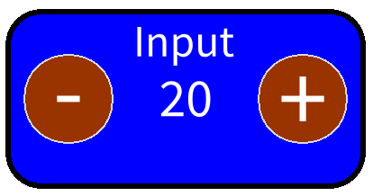
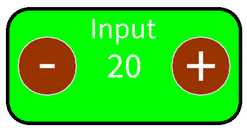

## Skinning a simple widget

In this chapter we show how we can take the simple input widget developed in a previous chapter and make it skinnable. 

In a first period, we will focus on what is called raw skins. The idea behind raw skins are that we define classes with states and methods to define the behavior of a skin in a given theme. At the end of this chapter we will see that we can also skin widgets
using stylesheets following the spirit of CSS. 
 
The outline of this chapter is then: first we show that we can extend a theme and define a skin. 
Then in a second time we show that we can define an autonomous theme. 
Finally we will show that we can use stylesheet

Remember that we want to create a widget as shown in Figure *@inputFinalSkin@*.


### Getting started

If you implemented the widget as presented earlier, just copy the class giving it a new name for example `ToIntegerInputElement`.
The definition of the `BlIntegerInputElement` is available SD:DefineAPlace.

The first thing that we should do is to make `ToIntegerInputElement` inherit from `ToElement` as follows:

```
ToElement << #ToIntegerInputElement
	slots: { #plus . #minus . #inputValue . #value . #inputLabel };
	tag: 'Input';
	package: 'Bloc-Book'
```

Our widget will then inherit the behavior to install a skin when instantiated, we can now define a skin

### Define a skin

We define a skin by inheriting from `ToRawSkin`, this class defines methods reacting to some events.
The class `ToRawSkin` is th default skin class when using the `ToRawTheme` which is the default theme but themes are detailed later.
In fact, skins in Toplo are EventHandlers we simply add to our elements, changing their visual properties according to incoming events

```
ToRawSkin << #ToInputElementSkin
	package: 'Bloc-Book'
```


These methods **need** to call themselves on `super` before declaring other behaviors
We will now define the actions that should be done when the skin is installed. 
Here for example we can change the border, background color and more.
Note that we can access the theme token properties using the message `valueOfTokenNamed:` or decide that 
can simply use values specific to this skin.


```
ToInputElementSkin >> installSkinEvent: anEvent
	"when installing the skin, changes the properties of widget mentionned down here"

	super installSkinEvent: anEvent.
	anEvent elementDo: [ :e |
		e size: 200 @ 100.
		e border: (BlBorder 
			paint: Color black
			width: 3).
		e background: Color blue.
		e geometry: (BlRoundedRectangleGeometry cornerRadius: 20).
		e plus background: Color brown.
		e plus border: (BlBorder 
			paint: (e valueOfTokenNamed: #'color-border')
			width: (e valueOfTokenNamed: #'line-width')).
		e minus background: Color brown.
		e minus border: (BlBorder 
			paint: (e valueOfTokenNamed: #'color-border')
			width: (e valueOfTokenNamed: #'line-width')).].
```

We also need to add the accessors of 'plus' and 'minus' elements.

```
ToIntegerInputElement >> plus
	^ plus
```
```
ToIntegerInputElement >> minus
	^ minus
```

Here we redefine the background of the element and its 'plus' and 'minus' sub-elements, but we also define a border to our element using tokens from our theme.
We accessed our element through the event received, this can be done in both following ways


##### Remark
Notice that the two following forms are equivalent. 
This is important if you want to maximize 

```
anEvent elementDo: [ :e | 
		e border: (e valueOfTokenNamed: #'color-border-checkable’).
```
```
target := anEvent currentTarget.
target border: target valueOfTokenNamed: #'color-border-checkable’)
```


Now that we defined our skin, we only need to tell our element to install this skins during initialization
In the `ToNumberInputElement` we define the method 

### Declaring the skin

The last step is to declare the skin to be used by the element. 
To do so we define the method `newRawSkin` in the class `ToNumberInputElement`.


```
ToIntegerInputElement >> newRawSkin

	^ ToInputElementSkin new
```


This `newRawSkin` method is the one called by default by the `ToRawTheme` on a ToElement to get the skin to install, here we simply gave it our brand new skin.

Update the `initialize` method in which we can now remove graphical properties definition.
In fact, we could leave the graphical properties definition because they are overriden either way when the skin is installed but removing them clears the code and helps the readability. 

```
ToIntegerInputElement >> initialize

	super initialize.
	self layout: BlFrameLayout new.
	self initializePlusButton.
	self initializeMinusButton.
	self initializeInputValue: 20.
	self label: 'Input'.
```

We can now open our element and see our new skin installed.




### Define a theme that extends an existing one

Here we show that we can refine an existing theme. 


```
ToRawTheme << #ToInputTheme
	package: 'Bloc-Book'
```


```
ToInputTheme class >> defaultTokenProperties
	"define here token properties of the widget theme"

	^ super defaultTokenProperties ,
	  { (ToTokenProperty
		   name: #'widget-color'
		   value: Color lightGreen) }
```

Here we defined a new theme that holds a new token property we could use in our skins.
For now our skin is used within the `ToRawTheme` which has no token property called #'widget-color' but we just defined one so let's use it.
* Note : We could override token properties by giving a new value for a same name but this token might already be used where you don't expect it. 
```
ToInputElementSkin >> installSkinEvent: anEvent
	super installSkinEvent: anEvent.
	anEvent elementDo: [ :e |
		e size: 200 @ 100.
		e border: (BlBorder 
			paint: Color black
			width: 3).
		e background: (e valueOfTokenNamed: #'widget-color').
		e geometry: (BlRoundedRectangleGeometry cornerRadius: 20).
		e plus background: Color brown.
		e plus border: (BlBorder 
			paint: (e valueOfTokenNamed: #'color-border')
			width: (e valueOfTokenNamed: #'line-width')).
		e minus background: Color brown.
		e minus border: (BlBorder 
			paint: (e valueOfTokenNamed: #'color-border')
			width: (e valueOfTokenNamed: #'line-width')).].
```

To see this token property from our new theme applied, we need to apply this theme to a space with the message `toTheme:`

```
space := BlSpace new.
space toTheme: ToInputTheme new.
anInput := ToIntegerInputElement new position: 200 @ 200.
space root addChild: anInput.
space show.
```




### Decorating a BlElement to get a ToElement

In the previous section, we said that the class has to inherit from `ToElement`, 
this is not entirely true you can also use the trait `TToElement` in the class
either directly or in a subclass as in the following definition. 

```
BlIntegerInputElement << #ToIntegerInputElement
	traits: {TToElement};
	package: 'Bloc-Book'
```

Since it does not make much sense to have both a non-skinnable widget and its skinnable
version (except in a tutorial) we believe that inheriting from `ToElement` will be the way to 
define skinnable widget. 

When you use a trait you should also refine the initialize method to invoke the trait initialization. 
```
ToNumberInputElement >> initialize
	super initialize. 
	self initializeForToplo
```


SD: we should check if the following is necessary
```
ToNumberInputElement >> onAddedToSceneGraph

    super onAddedToSceneGraph.
    self ensuredSkinManager requestInstallSkinIn: self.
    self addEventHandler: ToSkinStateGenerator new
```

### Autonome theme

We should now how we can define a full new theme.
We will 
- define a theme class
- define a skin class acting as root for the skins
- define a specific skin for the widget

#### Defining a new theme

To start defining a new theme, we obviously create a class inheriting from `ToTheme`.
```
ToTheme << #ToMooflooTheme
	slots: {};
	tag: 'Input';
	package: 'myBecherBloc'
```

A theme will try to apply skin corresponding to the type of skin defined in the theme, and those skins are called via the method we define in `newSkinInstanceFor:`.
Indeed this method will be called on all elements when the theme is applied. This tells each element to search and return an instance of the skin to apply to it.
The method called is by convention named "new[Theme name]Skin" 

```
ToMooflooTheme >> newSkinInstanceFor: anElement

	^ anElement newMooflooSkin
```

As the theme tries to apply a skin to each element, they need to return a default skin even if they are not supposed to have one.
We can then define the `ToBasicMooflooSkin` class as subclass of `ToBasicSkin` to have a 'default' skin.
Instances of `ToBasicMooflooSkin` can then be returned when needing a default skin for elements.
We then define `newMooflooSkin` as an extension method on BlElement.
```
ToBasicSkin << #ToBasicMooflooSkin
	slots: {};
	tag: 'Input';
	package: 'myBecherBloc'
```

```
BlElement >> newMooflooSkin

	^ ToBasicMooflooSkin new
```

For elements we want to skin, we can simply return an instance of the said skin in `newMooflooSkin`

```
ToNumberInputElement >> newMooflooSkin

	^ ToInputElementSkin new
```

If we execute this script where we redefine the space's theme, we can see it is applied just like in the example of the previous section 

```
space := BlSpace new.
space toTheme: ToMooflooTheme new.
anInput := ToIntegerInputElement new position: 200 @ 200.
space root addChild: anInput.
space show.

```

### Using a stylesheet

TODO
